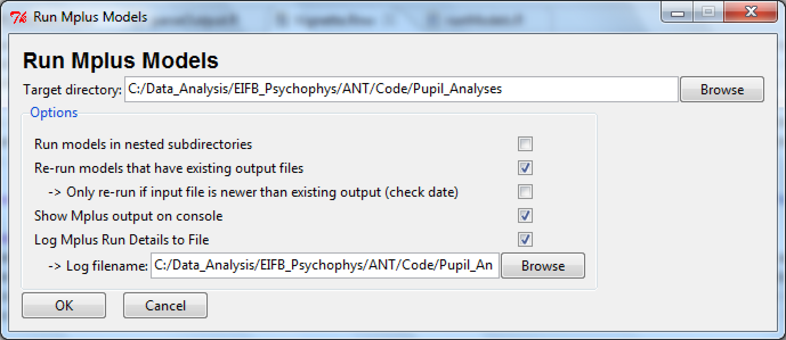
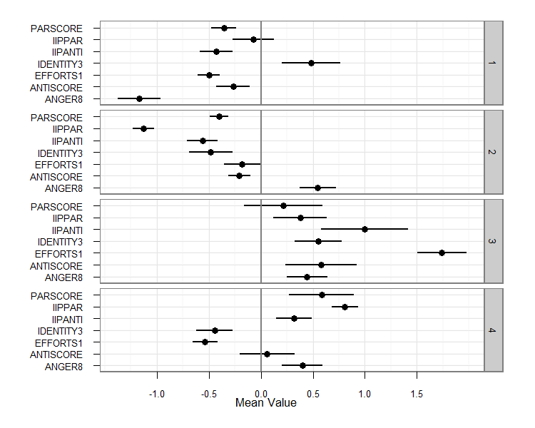

<!-- Note that I need to set the directory before building this file, but shouldn't set it using setwd -->
<!-- because then CRAN maintainers can't link to the same directory. -->
<!-- setwd(file.path(getMainDir(), "MplusAutomation/pkg/inst/doc")) -->


# Overview

This guide provides examples of how to use the functions in the `MplusAutomation` package.
The package is designed to automate three major aspects of latent variable modeling in `Mplus`:

1. creating related groups of models
2. running batches of models
3. extracting and comparing model parameters and fit statistics

The guide tries to make few assumptions about the user's familiarity with the
`R` environment, as many Mplus user's may be unfamiliar with `R`. Note that the `MplusAutomation`
package was written to be compatible with Mplus version 5.21 or later. Although many functions
are likely to work with earlier versions, there may be incompatibilities.

Note: some examples herein reference examples from the Mplus User's Guide. The input
and output files for these examples are assumed to reside in the directory:

`C:\Program Files\Mplus\Mplus Examples\User's Guide Examples`

If you have installed Mplus to a different location, please use the
correct directory in the code below.

## Clarifying the relationship between MplusAutomation and Mplus

Please note that `MplusAutomation` does not provide a copy of the `Mplus` software, which is proprietary.
All of the model estimation is handled by `Mplus` (think of it as the computation engine), while `MplusAutomation`
provides convenience functions for interfacing with `Mplus` in `R` and working with model outputs using familiar `R` data structures such as `data.frame` objects.

Thus, you must have a working copy of `Mplus` to estimate latent variable models using `MplusAutomation` using the
`runModels()` or `mplusModeler()` functions. If you would like to obtain a copy of `Mplus`, please follow the 
instructions on the [statmodel.com website](http://statmodel.com/orderonline/).

# Installing and loading the package

**Note**: You only need to install the `MplusAutomation` package *once* on a given machine. Once you follow 
these instructions, you can just use `library(MplusAutomation)` to load the package in future sessions.

The `MplusAutomation` package is compatible with `R` and `Mplus` on Windows, Mac OS X, and Linux platforms.

The package was initially built using `R` 2.15.1 and has been tested with modern versions
up through `R` 4.0.2. To obtain `R` follow [this link](https://cran.r-project.org/).

After installing `R` and launching a new session, type the following at the command line:

```{r, eval=FALSE, echo=TRUE}

install.packages("MplusAutomation")

``` 

If you're running on Windows, you may need to run `R` as an administrator (right-click, Run as administrator).

To load the `MplusAutomation` package so that its functions are available to use, type:


```{r}

library(MplusAutomation)

```

**Note:** Mac users using versions of `R` *prior to* 4.0.0 may experiences crashes if they have not setup
Tcl/Tk properly within `R`. The default distribution of Tcl/Tk shipped with Mac OS X is not compatible with `R`. Instead, users should download and install the Tcl/Tk distribution 
[here](https://cran.r-project.org/bin/macosx/tools/).

## Determine the version of `MplusAutomation` on your machine

To verify the version of `MplusAutomation` loaded in your `R` session,
type the following code which should provide a listing of all loaded packages.


```{r}

sessionInfo()

``` 

## Updating the package to the latest version

As is conventional for `R` packages, the latest version of `MplusAutomation` may be obtained from CRAN using the
`update.packages()` function in an `R` session. As of `r Sys.Date()`, the current version of the package is 
`r utils::packageVersion("MplusAutomation")`.

```{r, eval=FALSE}

update.packages(ask=FALSE, checkBuilt=TRUE)

```

# Exporting data from `R` to Mplus


The helper function, `prepareMplusData()`, eases the task of transferring data from `R` to Mplus. 
Mplus requires that files not have a header row and that the variable names be specified within 
the Mplus input syntax. The `prepareMplusData()` function converts an `R` `data.frame` object
(the typical way to represent two-dimensional data in `R`) to a tab-delimited file and it prints
the corresponding Mplus syntax to the console. This syntax can then be pasted into the head of
a new Mplus input file. Here are two basic examples of using the command:

```{r, eval=FALSE, echo=TRUE}

prepareMplusData(
  my_data,
  filename = "C:/Data_Analysis/Prepare Mplus.dat",
  keepCols=c("id", "item1", "item3", "item6"))

prepareMplusData(
  my_other_data,
  filename = "C:/Data_Analysis/Prepare Dropped Mplus.dat",
  dropCols=c("baditem1", "baditem2", "baditem7"))

```

The first call requests that only the variables specified by `keepCols` be included in the resultant
Mplus data file. In like manner, the second call requests that all variables except those specified by `dropCols`
by included in the data file. If neither `keepCols` nor `dropCols` is specified, then the entire
`data.frame` is output.

For factors and character variables (categorical), `prepareMplusData` converts each level into an integer value
(first level = 1, second level = 2, etc.) and prints out information about how the levels were converted
so that you can use them properly inside the Mplus syntax. Alternatively, if you use the 
`dummyCode` argument for `prepareMplusData`, you will get a set of dummy codes that can be used in the Mplus
syntax.

Here, in the `mtcars` dataset, we convert the number of gears (in the car) to a factor so that `prepareMplusData`
will know to convert its unique values (3, 4, 5) into an integer-valued variable (1, 2, 3) that can be used in
`Mplus` syntax. For the number of cylinders (`cyl`) and transmission type (`am`), we ask `prepareMplusData`
to generate dummy codes for each level of these factors. Note that one dummy code is returned for *each level*,
so no reference category is implied. Thus, it is up to you to drop one of the dummy codes in the Mplus syntax
to denote the reference category and avoid multicollinearity.

```{r}
data(mtcars)
mtcars$gear <- factor(mtcars$gear)
prepareMplusData(mtcars, "mtcars.dat", dummyCode = c("cyl", "am"))
```


# Running batches of Mplus models

A major purpose of the MplusAutomation package is to allow for easy runs of
batches/groups of Mplus models. Oftentimes, one wants to compare a group of
related models, such as testing for different forms of measurement invariance.
Depending on the complexity of the models, Mplus can take several minutes to many
hours to run each model. The \lstinline|runModels| routine is designed to run a group
of related models located within a directory (or nested subdirectories).

## Basic use of runModels

As an example, say that we want to run all of the models used in the Mplus 5.1
Addendum: http://statmodel.com/download/examples1.pdf. The input files for these
are located in: 
`C:\Program Files\Mplus\Mplus Examples\Addendum Examples`.

To run this batch, enter this at the command line:

```{r, eval=FALSE, echo = TRUE}

runModels("C:/Program Files/Mplus/Mplus Examples/Addendum Examples")

``` 

Note that you need to use forward slashes ("/"), not backslashes in
the path name. Alternatively, you could use double backslashes (e.g.,
`"C:\\Program Files"` etc.). 

## Advanced use of runModels

### Recursing through subdirectories

Sometimes it is useful to organize models into one or more subdirectories where each
subdirectory contains models for a particular outcome or analytic approach. For example,
if one were contrasting latent class analysis (LCA) with confirmatory factor analysis (CFA), one could
place all LCA models in a single directory and place CFA models in a different directory. 
This might yield a file structure like this:

```
ComparingLCAvCFA/LCA/1-class LCA.inp
ComparingLCAvCFA/LCA/2-class LCA.inp
ComparingLCAvCFA/LCA/3-class LCA.inp

ComparingLCAvCFA/CFA/1-factor CFA.inp
ComparingLCAvCFA/CFA/2-factor CFA.inp
ComparingLCAvCFA/CFA/3-factor CFA.inp
```


In this case, all Mplus files for the larger project are housed within a parent directory,
`ComparingLCAvCFA`. To run all models within `ComparingLCAvCFA`, including
models within any subdirectories (including `LCA` and `CFA`), use the `recursive`
parameter of `runModels`.

```{r, eval=FALSE, echo=TRUE}

runModels(
  "C:/Data_Analysis/ComparingLCAvCFA",
  recursive=TRUE)

``` 

### Logging the outcome of runModels

The `logFile` parameter of `runModels` allows the user to specify a text file containing the results
of `runModels`. Included in the log file are the parameters passed to the function, the date when the batch
started, which models were run (and which were skipped), and any actions taken if the `R` process was interrupted
(e.g., terminating the Mplus process). By default, `runModels()` will create a log file in the same directory
as the models to be run, `directory`, called `Mplus Run Models.log`. To change the name or location of this
file, specify the `logFile` parameter, such as in this example:

```{r, eval=FALSE, echo=TRUE}

runModels(
  "C:/Data_Analysis/ComparingLCAvCFA",
  recursive=TRUE,
  logFile="C:/CFALCA-Comparison-Log.txt")|

```

Here, the file `C:/CFALCA-Comparison-Log.txt` will be created in the directory `C:/`.

To specify that no log file should be created, pass `logFile=NULL` to `runModels()`.


```{r, eval=FALSE, echo=TRUE}

runModels(
  "C:/Data_Analysis/ComparingLCAvCFA",
  recursive=TRUE,
  logFile=NULL)

```

### Skipping models with existing output files

Sometimes it is useful to skip models that have already been run to avoid the computing time associated with
running all input files within a directory. The \lstinline|replaceOutfile| parameter allows one to specify
which models should be re-run, where models that have an output with the same filename as the input file are considered
to have been run. By default, `replaceOutfile="always"`, meaning that all input files will be run,
regardless of whether they have a matching output file.

To skip any model that already has an existing output file, pass
`replaceOutfile="never"` to `runModels()`, such as in this example:

```{r, eval=FALSE, echo=TRUE}

runModels(
  "C:/Data_Analysis/ComparingLCAvCFA",
  recursive=TRUE,
  replaceOutfile="never")

``` 

Oftentimes, after a model or group of models has been run, it is necessary to modify some aspects of the
parameterization to improve model fit or address estimation problems. In such cases, output files are inspected
and the corresponding input files are modified. In such cases, one may only want to run models that have been
updated, but not to re-run models that completed successfully. This can be accomplished by passing 
`replaceOutfile="modifiedDate"` to `runModels()`. The `"modifiedDate"` determines whether there is
an existing output file for a given input file. If there is, it checks to see whether the date the input file
was modified is *newer* than the output file. If the input file is newer, then the model is run. Otherwise,
it is skipped. Here is an example:

```{r, eval=FALSE, echo=TRUE}

runModels(
  "C:/Data_Analysis/ComparingLCAvCFA",
  recursive=TRUE,
  replaceOutfile="modifiedDate")

``` 

### Displaying `R` output in the console

When models are run by the Mplus Windows program (MplusWin.exe), a separate DOS window appears that documents
the TECH8 progress of the model, which represents the progress toward maximum-likelihood convergence for the model
(including random starts and final stage optimizations for some models). To display the same TECH8 output
for models run by `runModels()`, pass `showOutput=TRUE` to the `runModels()` function.

```{r, eval=FALSE, echo=TRUE}

runModels(
  "C:/Data_Analysis/ComparingLCAvCFA",
  recursive=TRUE,
  showOutput=TRUE)

``` 

If the `R` session was started through the `R` GUI (Rgui.exe), the
output will be displayed within the `R` window. 
If the `R` session was started using Rterm (the \textit{R} terminal),
a separate DOS window will display the output, as occurs using the
built-in Mplus Windows program. 

By default, the output is not shown, `showOutput=FALSE`.

# User-friendly interface to `runModels()`

A wrapper function, `runModels_Interactive()`, is included in the
`MplusAutomation package`, which provides a simple dialog box for
specifying which models to run. To start the interface, type the
following: 

```{r, eval=FALSE, echo=TRUE}

runModels_Interactive()

```

The picture below documents the appearance of this interface:

```{r, echo = FALSE, out.width = "80%", fig.pos="h", fig.cap = "Figure. Example of using runModels() in an interactive graphical interface."}



```

Although one can provide parameters to the function to set the initial
states of the interface, it is rarely necessary to do so, so the
syntax above should suffice. 

# `readModels()`: Extracting all supported data from Mplus output

The `readModels()` function provides a single method for extracting
all available information (that MplusAutomation currently handles) 
from one or more output files. This is the preferred method for information
from Mplus output files. More specifically, this function provides a wrapper
around four other user-accessible functions: `extractModelSummaries`,
`extractModelParameters`, `extractModIndices`, and
`getSavedata_Data`. The `readModels()` function also uses 
a number of additional functions not accessible to the user to read output
such as TECH1, TECH3, TECH4, TECH9, and RESIDUALS. The `readModels()` function
extracts model summaries, parameters, modification indices, and saved data
(using the Mplus SAVEDATA syntax), into a single list object (stored
as `mplus.model`). The top-level elements of the list represent
distinct output files and are named by the corresponding Mplus output
filename. Each `mplus.model` element of the list is composed of
several sub-elements, depending on the information in the output
file. Elements of an `mplus.model` object include: 


1. `summaries`: model summary statistics
2. `parameters`: model parameter estimates
3. `class_counts`: class counts and proportions for models that
  include a categorical latent variable. 
4. `mod_indices`: model modification indices
5. `savedata_info`: information about SAVEDATA output corresponding to this model
6. `savedata`: `data.frame` corresponding to SAVEDATA: FILE = ...
7. `bparameters`: an `mcmc.list` object containing the draws from the
  MCMC chains for a Bayesian model that uses the SAVEDATA: BPARAMETERS
  command 
8. `residuals`: a list containing relevant information from OUTPUT:
   RESIDUALS. 
9. `tech1`: a list containing parameter specification and starting
   values from OUTPUT: TECH1. 
10. `tech3`: a list containing parameter covariance and correlation
    matrices from OUTPUT: TECH3. 
11. `tech4`: a list containing means, covariances, and correlations
    for latent variables from OUTPUT: TECH4. 
12. `tech9`: a list containing error messages for each replication of
  a Monte Carlo simulation study from OUTPUT: TECH9. 
13. `lcCondMeans`: conditional latent class means, obtained using
  auxiliary(e) syntax in latent class models 
14. `gh5`: a list containing data from the gh5 (graphics) file
  corresponding to this output. (Requires `rhdf5` package).

Basic example:

```{r, eval=FALSE, echo=TRUE}

allOutput <- readModels(
  "C:/Data_Files/CFANesting",
  recursive=TRUE)

## assuming there are multiple files in this directory
## just model summaries could retained as a data.frame as follows:

library(plyr)
justSummaries <- do.call("rbind.fill",
  sapply(allOutput,"[", "summaries"))

```

The `rbind.fill` function is provided by the `plyr` package and is
used to combine `data.frame`s where the columns do not align perfectly
(as happens when Mplus output files differ in the form of their
summary statistics). The sapply call is used to extract only the
`summaries` element from each top-level element (i.e., file). 


# Extracting model summary statistics

Another major purpose of the package is to allow for easy extraction of model
summary statistics from one or more models. Such summary statistics include items such as
log-likelihood values, root mean squared error of approximation (RMSEA), and Akaike's Information
(AIC).

Please note: The preferred way to obtain summary statistics (and other Mplus
output) is the `readModels()` function, which is described above.

The `extractModelSummaries()` function is designed to extract model summaries from a group of models
located within a directory (or nested within subdirectories). This function returns a `data.frame`
containing one row per model, with columns representing several fit statistics. Note that `extractModelSummaries`
can also extract summaries from a single file by simply passing in a file, not a directory, as the `target`.

A basic call to the function includes the directory containing output files to be parsed:

```{r, eval=FALSE, echo=TRUE}

mySummaries <- extractModelSummaries(
  "C:/Data_Analysis/ComparingLCAvCFA",
  recursive = TRUE)

```

Now, the variable mySummaries is a `data.frame` containing summary statistics about models
contained in the `ComparingLCAvCFA` directory.

As with `runModels()`, `extractModelSummaries()` includes a `recursive` parameter
that specifies whether to parse output files located in subdirectories beneath the target directory
(defaults to `FALSE`).

In addition, `extractModelSummaries()` also includes a parameter, `filefilter`, that allows
the user to parse only files matching certain search criteria. `filefilter` accepts a Perl-compatible
regular expression string. If you're unfamiliar with regular expressions in Perl, 
I suggest these two websites:

* http://www.pcre.org/pcre.txt
* https://www.regular-expressions.info/

Note that many regular expression in Perl rely on backslashes (\\) for
defining character classes, escaping certain characters, and so on. In `R`, backslashes contained
in strings must be doubled (i.e., \\\\).

Here is an example of filtering only files that match "ex4" followed by any characters
Note that the function automatically searches only files with the .out extension, so it isn't
necessary to include .out in the file filter.

```{r, eval=FALSE, echo=FALSE}

summaryStats <- extractModelSummaries(
  "C:/Program Files/Mplus/Mplus Examples/User's Guide Examples/Outputs",
  filefilter="ex4.*")

```

Here is a more complex filter that matches filenames that begin with the digits 1, 2, or 3
(for 1-class, 2-class, or 3-class output files) and also contain the text "Threshold":

```{r, eval=FALSE, echo=TRUE}

summaryStats <- extractModelSummaries(
  "C:/Data_Analysis/Multiclass Models",
  filefilter="[123]{1}-class.*Threshold.*")

```

## Listing of summary statistics extracted by extractModelSummaries

As of this version of the package (0.5), the following summary statistics are automatically extracted,
when available:

* `Title`: Title for the model, specified by the TITLE: command
* `Filename`: Filename of the output file
* `InputInstructions`: A string containing the full input syntax for the model
* `Estimator`: Estimator used for the model (e.g., ML, MLR, WLSMV, etc.)
* `LL`: Log-likelihood of the model
* `BIC`: Bayesian Information Criterion
* `aBIC`: Sample-Size-Adjusted BIC (Sclove, 1987)
* `AIC`: Akaike's Information Criterion
* `AICC`: Corrected AIC, based on Sugiura (1978) and recommended by Burnham \& Anderson (2002)
* `DIC`: Deviance Information Criterion. Available in ESTIMATOR=BAYES output.
* `Parameters`: Number of parameters estimated by the model
* `pD`: Estimated number of parameters in Bayesian output
* `Observations`: The number of observations for the model (does not suppport multiple-groups analysis at this time)
* `CFI`: Confirmatory Fit Index
* `TLI`: Tucker-Lewis Index
* `RMSEA_Estimate`: Point estimate of root mean squared error of approximation
* `RMSEA_90CI_LB`: Lower bound of the 90\% Confidence Interval around the RMSEA estimate
* `RMSEA_90CI_UB`: Upper bound of the 90\% Confidence Interval around the RMSEA estimate
* `RMSEA_pLT05`: Probability that the RMSEA estimate falls below .05, indicating good fit
* `ChiSqM_Value`: Model chi-squared value
* `ChiSqM_DF`: Model chi-squared degrees of freedom
* `ChiSqM_PValue`: Model chi-squared p value
* `ObsRepChiSqDiff_95CI_LB`: Lower bound of 95\% confidence interval for the difference between observed and replicated chi-square values
* `ObsRepChiSqDiff_95CI_UB`: Upper bound of 95\% confidence interval for the difference between observed and replicated chi-square values
* `PostPred_PValue`: Posterior predictive p-value
* `BLRT_KM1LL`: Log-likelihood of the K-1 model (one less class) for the Bootstrapped Likelihood Ratio Test (TECH14)
* `BLRT_PValue`: P-value of the Bootstrapped Likelihood Ratio Test (TECH14) testing whether the K class model is significantly better than K-1
* `BLRT_Numdraws`: The number of bootstrapped samples used in the Bootstrapped Likelihood Ratio Test
* `SRMR`: Standardized root mean square residual
* `WRMR`: Weighted root mean square residual
* `ChiSqBaseline_Value`: Baseline (unstructured) chi-squared value
* `ChiSqBaseline_DF`: Baseline (unstructured) chi-squared degrees of freedom
* `ChiSqBaseline_PValue`: Baseline (unstructured) chi-squared p value
* `NumFactors`: For TYPE=EFA output, the number of factors
* `T11_KM1Starts`: TECH11: Number of initial stage random starts for k-1 model
* `T11_KM1Final`: TECH11: Number of final stage optimizations for k-1 model
* `T11_KM1LL`: TECH11: Log-likelihood of the K-1 model used for the Vuong-Lo-Mendell-Rubin LRT
* `T11_VLMR_2xLLDiff`: TECH11: 2 * Log-likelihood Difference of K-class vs. K-1-class model for the Vuong-Lo-Mendell-Rubin LRT
* `T11_VLMR_ParamDiff`: TECH11: Difference in number of parameters between K-class and K-1-class model for the Vuong-Lo-Mendell-Rubin LRT
* `T11_VLMR_Mean`: TECH11: Vuong-Lo-Mendell-Rubin LRT mean
* `T11_VLMR_SD`: TECH11: Vuong-Lo-Mendell-Rubin LRT standard deviation
* `T11_VLMR_PValue`: TECH11: Vuong-Lo-Mendell-Rubin LRT p-value
* `T11_LMR_Value`: TECH11: Lo-Mendell-Rubin Adjusted LRT value
* `T11_LMR_PValue`: TECH11: Lo-Mendell-Rubin Adjusted LRT p-value
	
The `extractModelSummaries()` function is designed to work in conjunction with functions that generate
tables of summary statistics (see below).

# Summarizing model fit statistics in tabular form

Once summary statistics for a group of models have been extracted, it is often useful
to display them in tabular form to compare fit among models, sorted by a particular
criterion (e.g., AIC).

The `MplusAutomation` package provides three routines for tabulating model summary
statistics. At this time, there are three table-generating functions, which are detailed below:
`showSummaryTable()`, `HTMLSummaryTable()`, `LatexSummaryTable()`.

As their names suggest, these functions can create tables for on-screen display
(`showSummaryTable()`), as an HTML file containing the table (` HTMLSummaryTable()`),
or as a LaTex-formatted table (` LatexSummaryTable()` ).

## Displaying the summary table on the screen

The ` showSummaryTable()`  function is designed to display a summary table of model fit statistics on the screen.
The function expects a model list created by ` extractModelSummaries()`  and allows the user to specify which
columns should be included in the table.

Here is a simple example of using `showSummaryTable()` by specifying which columns to keep in the table:

```{r, eval=FALSE, echo=TRUE}

showSummaryTable(
  summaryStats,
  keepCols = c("Title", "LL", "AIC", "BIC", "CFI"),
  sortBy = "AIC")

``` 

And another example specifying that all columns in the model list should be displayed *except* those
specified:

```{r, eval=FALSE, echo=TRUE}

showSummaryTable(
  summaryStats,
  dropCols = c("InputInstructions", "Observations", "Parameters"),
  sortBy = "CFI")

``` 
 
## Creating a summary table in HTML

The `HTMLSummaryTable()` function creates an HTML file containing a summary table of model fit statistics.
Its syntax is very similar to `showSummaryTable()`, including parameters such as `dropCols`, `keepCols`, and `sortBy`.
Two parameters distinguish it from other summary functions: `filename` and `display`.

The `filename` parameter specifies the path and filename of the HTML file to be created. `display`
specifies whether to display the HTML summary table in the web browser after it is created. Here is a simple
of using the function:

```{r, eval=FALSE, echo=TRUE}

HTMLSummaryTable(
  summaryStats,
  filename = "C:/MyModelSummary.html",
  display = TRUE,
  keepCols = c("Title", "LL", "AIC", "BIC", "AICC"),
  sortBy = "AIC")

```
  
## Creating a summary table in LaTeX

One major strength of `R` is its ability to be interwoven with LaTeX, an advanced typesetting language. The most
frequently used approach for combining `R` and LaTex is Sweave (https://cran.r-project.org/doc/Rnews/Rnews_2002-3.pdf),
a built-in `R` function that runs `R` code embedded in a LaTeX document, thereby permitting the creation of
advanced automated reports.

Mplus model fit summary tables can be formatted in LaTeX using the `LatexSummaryTable()` function. Unlike
`showSummaryTable()` and `HTMLSummaryTable()`, `LatexSummaryTable()` returns a value, specifically the
LaTeX syntax for the summary table. Here is a simple example of the function

```{r, eval=FALSE, echo=TRUE}

myLatexTable <- LatexSummaryTable(
  summaryStats,
  keepCols = c("Title", "BIC", "Parameters"),
  sortBy = "Parameters",
  caption = "Comparing CFA vs. LCA according to number of parameters",
  label="CFALCATab")

``` 

Note that `LatexSummaryTable()` supports two distinct parameters relative to other summary table functions:
`caption()` and `label()`. These allow the user to set the caption and label properties of the table,
which are used in LaTex for displaying a caption with the table and for allowing the table to be easily referenced
in other parts of document, respectively. See https://en.wikibooks.org/wiki/LaTeX/Tables#The_table_environment_-_captioning_etc
for further details about LaTeX tables.

The LaTeX syntax for a summary table could be included in an Sweave document in the following way:

```
<<echo=TRUE, results=tex>>=

myLatexTable <- LatexSummaryTable(
  summaryStats, 
  keepCols = c("Title", "BIC", "Parameters"), 
  sortBy = "Parameters", 
  caption = "Comparing CFA vs. LCA according to number of parameters", 
  label = "CFALCATab")

print(myLatexTable)
@

```

See the Sweave manual for more details about combining LaTeX with `R`.


# Extracting model modification indices

The `extractModIndices()` function extracts the model modification indices from
the MODEL MODIFICATION INDICES sections of one or more Mplus output files. It is up to the user to request
modification indices using OUTPUT: MODINDICES, and for some models, such indices are not available (as noted
in the WARNINGS section of the Mplus output.

Model modification indices are returned as a data.frame of the form:

```
modV1 operator modV2     MI    EPC Std_EPC StdYX_EPC
BORD1       ON BORD9 12.427 -0.284  -0.284    -0.231
BORD9     WITH BORD1 12.427 -0.053  -0.053    -0.222
```

These columns follow the conventions used in Mplus where EPC refers to the expected parameter change
if the designated relationship is estimated.

# Extracting model parameters

The `extractModelParameters()` function extracts the model parameters from
the MODEL RESULTS and STANDARDIZED MODEL RESULTS sections of a given Mplus output file.
Examples of such parameters include the parameter estimate, std. err, param/s.e., and two-tailed p-value.

Further, `extractmodelParameters()` supports extraction of results from
many output files, with the results being returned as a list object, one element per output file. When available,
unstandardized and standardized (StdYX, StdY, Std) parameters are extracted from each output file into a list object
whose elements are `data.frame` objects. Relatedly, the `resultType` parameter has been deprecated and will
be removed in a future version.

## Example: Extracting parameters from a single file

```{r, eval=FALSE, echo=TRUE}

modelResults <- extractModelParameters(
  "C:/Data_Analysis/Mplus Output.out")

```

The above call will return a list with unstandardized and standardized results (if requested by including OUTPUT: STANDARDIZED)
from the Mplus Output.out file. If all standardizations are available in the output, the returned list will have the following elements:
`unstandardized`, `stdyx.standardized`, `stdy.standardized`, and `std.standardized`. Each of these
elements is a `data.frame` containing model results for the relevant section. Such elements may be accessed in using traditional `R`
list operators, such as:

```{r, eval=FALSE, echo=TRUE}

unstandardizedResults <- modelResults$unstandardized

#equivalently
standardizedResults <- modelResults[["stdyx.standardized"]]

```

## Example: Extracting parameters from multiple files

By passing in a directory as the `target` parameter to `extractModelParameters()`, parameters for all files in the specified
directory will be parsed and returned as a list, with one element per file. As with `extractModelSummaries()`, the `recursive`
parameter specifies whether to parse files nested within subdirectories, and the `filefilter` specifies and optional Perl-compatible
regular expression for parsing only matching files within the `target` directory.

Say, for example, that there were two subdirectories within the ComparingLCAvCFA directory with 3 outputs each.
Note that this example builds on the recursive `runModels()` example above.

```
ComparingLCAvCFA/LCA/1-class LCA.out
ComparingLCAvCFA/LCA/2-class LCA.out
ComparingLCAvCFA/LCA/3-class LCA.out

ComparingLCAvCFA/CFA/1-factor CFA.out
ComparingLCAvCFA/CFA/2-factor CFA.out
ComparingLCAvCFA/CFA/3-factor CFA.out
```

Then the following code would extract model parameters for all files in the directory structure, returning each output as a list element.

```{r, eval=FALSE, echo=TRUE}

allModelParameters <- extractModelParameters(
  "C:/Data_Analysis/ComparingLCAvCFA",
  recursive = TRUE)

```

The names of the returned list elements would be based on the directory and file names of each file (note that spaces, slashes, and the
minus sign have been replaced by periods to be compatible with `R` naming conventions):

```{r, eval=FALSE, echo=TRUE}
names(allModelParameters)

## ComparingLCAvCFA.LCA.1.class.LCA.out
## ComparingLCAvCFA.LCA.2.class.LCA.out
## ComparingLCAvCFA.LCA.3.class.LCA.out
## ComparingLCAvCFA.CFA.1.factor.CFA.out
## ComparingLCAvCFA.CFA.2.factor.CFA.out
## ComparingLCAvCFA.CFA.3.factor.CFA.out

```

So, to extract the STDYX standardized results for the 2-factor CFA, one would access that \lstinline|data.frame| as follows:

```{r, eval=FALSE, echo=TRUE}

TwoFacCFA.STDYX <- allModelParameters$ComparingLCAvCFA.CFA.2.factor.CFA.out$stdyx.standardized

```

### Extracting and combining model results across files and sections

Depending on the application, it may be useful to only retain certain sections or to build a single large data.frame from the multi-file
list. What follows are a few standard `R` practices for combining and subsetting data that may be unfamiliar to inexperienced `R` users. These
examples serve to demonstrate how to work with the `extractModelParameters()` list flexibly.

**Example: Only retaining unstandardized output**

By default, `extractModelParameters()` returns unstandardized and standardized output, where available. To retain only unstandardized results, for example,
one could do the following (building on the CFA v. LCA example above):

```{r, eval=FALSE, echo=TRUE}

unstandardizedOnly <- sapply(allModelParameters, "[", "unstandardized")

```

Note that the variable names of the `unstandardizedOnly` list will represent a concatenation of the filename with the unstandardized keyword.
For example, the first element will now be named: `ComparingLCAvCFA.LCA.1.class.LCA.out.unstandardized`. Names can be manually tweaked using
the `names` function. For example, to retain the existing filenames without appending .unstandardized, this would work:

```{r, eval=FALSE, echo=TRUE}

oldNames <- names(allModelParameters)
unstandardizedOnly <- sapply(allModelParameters, "[", "unstandardized")
names(unstandardizedOnly) <- oldNames

```

**Example: Combining multi-file output into a single `data.frame`**

Rather than having a list of model results, where each element represents the parameters from a single file, it may be useful
to combine these results into a single data.frame. The following code would accomplish this (assumes the immediately prior code was run):

```{r, eval=FALSE, echo=TRUE}

#add the filename as a field in the data.frame (so it's uniquely identified when combined)
lapply(names(unstandardizedOnly), function(element) {
	unstandardizedOnly[[element]]$filename <<- element
})

#this will only work if all data.frames have identical columns (i.e., same Mplus output fields)
combinedParameters <- do.call("rbind", unstandardizedOnly)

```

Now, `combinedParameters` is a single `data.frame` where each output file is identified by a `filename` field.

## Basic structure of each model results section

At the most basic level, model parameters for a given section (and perhaps a given file) are stored as a `data.frame`.
Variables included in such `data.frame` objects include:


1. paramHeader: The header that begins a given parameter set. Example: "FACTOR1 BY"
2. param: The particular parameter being measured (within `paramHeader`). Example: "ITEM1"
3. paramest: Parameter estimate value
4. se: Standard error of the estimate
5. est_se: Quotient of `paramest/se`, representing z-test/t-test in large samples
6. pval: Two-tailed p-value for the `est_se` quotient

Some models may provide different parameters, such as posterior standard deviation for Bayesian models, and these are
extracted appropriately by the function. See the `R` documentation for the function: `?extractModelParameters` for details
about variable names for different model types.

## Capitalizing on the graphics strength of `R` to visualize results

One of the major strengths of `R` is its graphics functionality. Numerous functions are provided
by base `R`, such as `hist()`, `plot()`, and `curve()`. Furthermore,
impressively flexible and powerful graphics functionality is now provided in `R` by the `grid`
graphics framework. An useful introduction to graphics in `R` is provided by Paul Murrell's book,
*R Graphics, Second Edition* published by CRC Press. In particular, the `ggplot2` and
`lattice` graphics package for `R` provide powerful functions for `R` graphics.

By contrast, Mplus has very basic graphics functionality that lacks the flexibility and robustness of `R`.

Now that we have illustrated how to import Mplus model parameter estimates into `R`,
here are just a couple of examples of how useful graphs in \textit{R} can be developed
from `extractModelParameters()` data.

**Example: Plotting means and standard errors from a finite mixture model**

The example model to be plotted comes from a finite mixture model with seven continuous
indicators of a latent construct, each scaled to zero mean and unit variance. The intention of
this plot is to visualize the means and standard error of each indicator across the latent classes.

```{r, eval=FALSE, echo=TRUE}

  library(MplusAutomation)
  library(ggplot2)
  modelParams <- extractModelParameters("output_to_plot.out)$unstandardized
  modelParams <- subset(modelParams,
    paramHeader=="Means" &
      LatentClass != "Categorical.Latent.Variables",
    select=c("LatentClass", "param", "est", "se"))
  
  limits <- aes(ymax = est + se, ymin=est - se)
	
	fmmMeanPlot <- ggplot(modelParams, aes(x=param, y=est)) +
	    geom_pointrange(limits) +
	    scale_x_discrete("") +
	    geom_hline(yintercept=0, color="grey50") +
	    facet_grid(LatentClass ~ .) +
	    theme_bw() +
	    ylab("Mean Value") +
	    coord_flip()
	print(fmmMeanPlot)

```

This relatively brief code snippet provides a relatively useful plot of this
sort:

```{r, echo = FALSE, out.width = "80%", fig.pos="h", fig.cap = "Figure. Example of graphing finite mixutre model results from Mplus using ggplot2."}



```

# Comparing summaries and parameters across models

An important part of interpreting results from latent variable models is the comparison of model fit indices and parameter estimates across
related sets of models. For example, when an additional covariate is included in the model, how do the other parameter estimates change?
The `compareModels()` function is designed to compare model fit indices and/or parameter estimates across two models.

This function also computes chi-square difference tests for nested models estimated with the ML, MLM, MLR, WLS, or WLSM estimators
using the `diffTest` parameter.

To use `compareModels()`, I recommend using `readModels()` to extract various fit statistics and parameters
from two or more models. You can pass in the results of `extractModelSummaries()` or `extractModelParameters()`
to `compareModels()`, but the output will be limited to summaries or parameters, respectively.

Here is a brief example of how one might use `compareModels()`.

```{r, eval=FALSE, echo=TRUE}

parallelModels <- readModels("10_14_Harsh_SelfCon_Impul")

compareModels(parallelModels[["backport.from.grand.model.out"]],
  parallelModels[["backport.from.grand.model.slopesonw1.out"]],
  show = c("diff", "pdiff", "summaries", "unique"),
  equalityMargin = c(param = .05, pvalue = .02),
  sort = "type", diffTest = TRUE, showNS = FALSE)

```

```
Mplus model comparison
----------------------

------
Model 1:  10_14_Harsh_SelfCon_Impul/backport from grand model.out
Model 2:  10_14_Harsh_SelfCon_Impul/backport from grand model slopesonw1.out
------

Model Summary Comparison
------------------------

             m1                                    m2
Title        Harsh Impul Self-Control Trivariate   Harsh Impul Self-Control Trivariate
               LGCM with W1 Covariates - No Direct   LGCM with W1 Covariates - Direct
               Influence of W1 on Slopes and         Influence of W1 on Slopes and
               Intercepts                            Intercepts
Observations 2187                                  2187
Estimator    MLR                                   MLR
Parameters   87                                    103
LL           -69851.911                            -69820.77
AIC          139877.821                            139847.539
BIC          140372.876                            140433.639
ChiSqM_Value 280.781                               222.538
ChiSqM_DF    129                                   113
CFI          0.984                                 0.988
TLI          0.977                                 0.981
SRMR         0.025                                 0.022

  MLR Chi-Square Difference test for nested models based on loglikelihood
  -----------------------------------------------------------------------

  Difference Test Scaling Correction:  1.033437
  Chi-square difference:  60.2668
  Diff degrees of freedom:  16
  P-value:  0

  Note: The chi-square difference test assumes that these models are nested.
  It is up to you to verify this assumption.

  MLR Chi-Square Difference test for nested models
  --------------------------------------------

  Difference Test Scaling Correction: 1.03125
  Chi-square difference: 60.44
  Diff degrees of freedom: 16
  P-value: 0

Note: The chi-square difference test assumes that these models are nested.
  It is up to you to verify this assumption.

=========

Model parameter comparison
--------------------------


  Parameter estimates that differ between models (param. est. diff > 0.05)
  ----------------------------------------------
        paramHeader      param m1_est m2_est . m1_se m2_se . m1_est_se m2_est_se . m1_pval m2_pval
          SCC_S1.ON      IMP_I  0.155  0.073 | 0.036 0.050 |     4.255     1.478 |   0.000   0.139
         HPC_I.WITH      IMP_I  0.128  0.182 | 0.066 0.069 |     1.927     2.634 |   0.054   0.008
         SCC_I.WITH      HPC_I  1.391  1.455 | 0.189 0.183 |     7.372     7.949 |   0.000   0.000
         SCC_I.WITH      IMP_I  0.213  0.352 | 0.127 0.134 |     1.682     2.624 |   0.093   0.009
        SCC_S1.WITH     SCC_S2 -0.584 -0.649 | 0.160 0.157 |    -3.638    -4.141 |   0.000   0.000
         Intercepts A11XEMOTSP  4.523  4.592 | 0.568 0.568 |     7.964     8.084 |   0.000   0.000
         Intercepts      HPC_I  5.272  5.528 | 0.225 0.243 |    23.446    22.723 |   0.000   0.000
         Intercepts      HPC_S  0.725  0.583 | 0.092 0.092 |     7.865     6.358 |   0.000   0.000
         Intercepts      IMP_I -0.661 -0.544 | 0.155 0.167 |    -4.263    -3.252 |   0.000   0.001
         Intercepts      SCC_I  4.113  4.299 | 0.390 0.409 |    10.547    10.515 |   0.000   0.000
         Intercepts     SCC_S2  4.811  5.008 | 0.382 0.418 |    12.604    11.987 |   0.000   0.000
 Residual.Variances   A10CHARP  2.376  2.299 | 0.158 0.156 |    15.016    14.719 |   0.000   0.000
 Residual.Variances   A10CSELF  6.871  6.544 | 0.554 0.534 |    12.405    12.245 |   0.000   0.000
 Residual.Variances   A12CSELF  6.298  6.206 | 0.406 0.401 |    15.531    15.493 |   0.000   0.000
 Residual.Variances   A14CHARP  2.019  1.959 | 0.154 0.150 |    13.149    13.075 |   0.000   0.000
 Residual.Variances   A14CSELF  2.547  2.654 | 0.903 0.896 |     2.821     2.961 |   0.005   0.003
 Residual.Variances      HPC_I  2.634  2.764 | 0.166 0.162 |    15.846    17.079 |   0.000   0.000
 Residual.Variances      SCC_I  7.086  7.433 | 0.574 0.552 |    12.351    13.463 |   0.000   0.000
 Residual.Variances     SCC_S1  0.606  0.680 | 0.140 0.131 |     4.312     5.203 |   0.000   0.000


  P-values that differ between models (p-value diff > 0.02)
  -----------------------------------
 paramHeader param m1_est m2_est . m1_se m2_se . m1_est_se m2_est_se . m1_pval m2_pval
    HPC_S.ON IMP_I  0.049  0.028 | 0.011 0.015 |     4.243     1.894 |   0.000   0.058
   SCC_S1.ON IMP_I  0.155  0.073 | 0.036 0.050 |     4.255     1.478 |   0.000   0.139
  HPC_I.WITH IMP_I  0.128  0.182 | 0.066 0.069 |     1.927     2.634 |   0.054   0.008
  SCC_I.WITH IMP_I  0.213  0.352 | 0.127 0.134 |     1.682     2.624 |   0.093   0.009


  Parameters unique to model 1: 0
  -----------------------------

  None


  Parameters unique to model 2: 16
  -----------------------------

 paramHeader     param m2_est m2_se m2_est_se m2_pval
    HPC_S.ON W1PHARPUN  0.038 0.008     4.884   0.000
   SCC_S1.ON   W1PSELF  0.034 0.014     2.389   0.017


  14 filtered from output (fixed and/or n.s.)

    HPC_S.ON.IMPLW1, HPC_S.ON.W1PNEGEM, HPC_S.ON.W1PSELF, SCC_S1.ON.IMPLW1,
    SCC_S1.ON.W1PHARPUN, SCC_S1.ON.W1PNEGEM, SCC_S2.ON.IMPLW1,
    SCC_S2.ON.W1PHARPUN, SCC_S2.ON.W1PNEGEM, SCC_S2.ON.W1PSELF,
    IMP_S.ON.IMPLW1, IMP_S.ON.W1PHARPUN, IMP_S.ON.W1PNEGEM, IMP_S.ON.W1PSELF


==============
```

As can be discerned above, the example `compareModels()` call above compares two nested models
from the list returned by `readModels()`. The `show` argument requests a comparison
of parameter value difference (`"diff"`), p-value differences (`"pdiff"`),
summary statistics (`"summaries"`), and parameters unique to each model (`"unique"`).
 
Parameter estimate differences must exceed .05 to be displayed, and p-value differences must exceed .02
(this is specified by the `equalityMargin` argument).

The parameter comparisons are sorted by type (factor loadings, regressions, covariances, residual variances, etc.).
A chi-square difference test is requested using `diffTest=TRUE`. And non-significant parameters are removed
from the model comparison (`showNS=FALSE`).

# Creating a group of models from an Mplus template file (`createModels()`)

The third major focus of the `MplusAutomation` package is to provide tools that automate
the process of creating input files for a related group of models. Perhaps the simplest
example of a related group of models is latent class analysis, where one runs a certain
model with different numbers of classes, but the input files are otherwise the same.

The `createModels()` function converts a single Mplus template file into a set of related
Mplus input files. The template language is a simple extension of the Mplus language that allows dynamic
values to be inserted into Mplus syntax files while reusing most of the code. The basic notion for
template files is that multiple input files are created by looping over one or more variables
(called "iterators") and substituting specific values that change for each model, thereby allowing for the
creation of related input files that share much of the code. As a basic example, one might iterate over a set of
outcome variables (e.g., positive emotions, negative emotions, and conscientiousness) in a growth model
where the dataset remains fixed, but the outcome variables change.

Mplus template syntax files are divided into two sections: the init section and the body section. The init section
consists of definitions for variables to be inserted in the Mplus syntax, instructions for determining the filename and directory
for created input files, and the variables to loop over to create multiple Mplus input files. The body section
consists of Mplus syntax with template tags included where certain variables will change (e.g., the number of
classes, names of outcome variables, etc.). Tags in Mplus syntax language are demarcated by double brackets.
For example, the tag `[[outcomeName]]` requests that the value of \lstinline|outcomeName| provided in
the init section be inserted into the Mplus syntax file.

Before we get into details, a particularly simple example may make the general concepts more tangible. This
example is adapted from Mplus User's Guide Example 7.3: LCA with binary latent class indicators using automatic
starting values with random starts.

```
[[init]]
iterators = classes;
classes = 1:7;
filename = "[[classes]]-class LCA 7.3.inp";
outputDirectory = "C:/MplusAutomation/LCA Outputs";
[[/init]]

TITLE: this is an example of a LCA with binary
latent class indicators using automatic
starting values with random starts
DATA: FILE IS ex7.3.dat;
VARIABLE: NAMES ARE u1-u4 x1-x10;
USEVARIABLES = u1-u4;
CLASSES = c ([[classes]]);
CATEGORICAL = u1-u4;
AUXILIARY = x1-x10 (e);
ANALYSIS: TYPE = MIXTURE;
OUTPUT: TECH1 TECH8 TECH10;
```

The above template file instructs the `createModels()` function to loop over a variable called `classes`.
The `classes` variable is defined as the integers from 1-7 (the colon in 1:7 indicates a sequence).
Files should be named according to the number of classes, so when `classes = 5`, then `filename = "[[classes]]-class LCA 7.3.inp";`
will evaluate to `5-class LCA 7.3.inp`. All files will be saved in the directory `C:/MplusAutomation/LCA Outputs`. Note that
R`` uses forward slashes, not backslashes, to indicate directory paths.

In the body section of this simple example, the only thing that changes is the definition `CLASSES = c([[classes]])`. And because
`classes` was defined as the integers from 1-7, 7 Mplus input files will be created by `createModels()` with the major difference
being the number of classes. As `createModels()` loops over the classes variable, the current value of classes is inserted in the body section.
  
## Init section 
The init section consists of variable definitions that are used to specify which variables are iterators,
the number of iterations/models to loop over, the filenames and directories for the input files created
by `createModels()`, and the fields to be inserted in the body section where template tags are specified.
Variable definitions in the iterator section use the syntax `variable = value;`. Variable names
are case-sensitive and value fields can span multiple lines. All definitions must be terminated by a semicolon.
In cases where the variable's value is a series of items (e.g., `outcome1`, `outcome2`,
`outcome3`, these should be specified as a space-separated list (either using spaces or tabs). For example,
if one wants to link a particular variable to an iterator and for the value of that list to be included in the
body section, the definitions might look something like:

```
[[init]]
iterators = outcome;
outcome = 1:4;
outcomeNames#outcome = Conscien Extraver Agreeabl Openness;
filename = "CFA for [[outcomeNames#outcome]].inp";
outputDirectory = C:/;
[[/init]]
```
  
Here, four input files will be created corresponding to four different outcome variables: Conscien, Extraver,
Agreeabl, and Openness (which are all presumably defined in the body section of the template). The main point here
is that the outcomeNames variable is defined as a four-item list, not as a single value. In cases where the values
of a variable need to contain spaces, be sure to include the values in double quotes. For example, we might modify
the outcomeNames field to be:

```
outcomeNames#outcome = "Conscientiousness Score" "Extraversion Score" "Agreeableness Score" "Openness Score";
```

This point deserves emphasis: 
**spaces are assumed to specify distinct values unless they are enclosed in double quotes**. 
This behavior is similar to the Mplus language, where syntax such as `VARIABLES = var1 var2 var3;`
defines three distinct variable names. Even where a given variable in the init section has only one value (such as `filename`
above), double quotes must be used if the spaces are to be included in the created files, rather than being interpreted as a list.

### Required init definitions 

Three variables must be defined for all Mplus template files.

**First**, the `iterators` variable defines
which variables in the init section are iterators (i.e., integer variables to be looped over to create the
input files). Iterators will be looped over in the order specified by the definition of `iterators`.
Here is an example of three iterators that will create a total of 60 files (4*5*3).

```
[[init]]
iterators = outcome model classes;
outcome = 1:4;
model = 1:5;
classes = 2 3 4;
filename = "[[classes]]-class Model.inp";
outputDirectory = C:/Data/[[outcome]]/[[model]];
[[/init]]
```

In the above example, the program will loop over `outcome`, `model`, and `classes`
in that order. So the first file to be created would be outcome=1, model=1, classes=1, the second model would be
outcome=1, model=1, classes=2, etc. For the more technical reader, iterators are processed recursively from left to right
(here, classes within model within outcome). The top-most iterator is `outcome` and the bottom-most is `classes`.
Don't worry too much about this, though. In most cases, the ordering does not matter much and one generally will not
hvae to think about how the program handles the iterators.

The **second** required init variable is `filename`. This variable defines the filenames for input
files created by the `createModels()` function. In general, these should end in ".inp" to be consistent with
Mplus conventions. Other tags can be (and probably should be) included in the filename definition. The idea is that
the combination of `filename` and `outputDirectory` should define a unique file/path for *each*
input file created by the `createModels()` function. Remember that if your filename contains any
spaces, please use double quotes.

The **third** required init variable is **outputDirectory**. This variable defines the directory (or
directories) where input files should be saved. **Please note:** If directories specified by `outputDirectory`
do not exist, the `createModels()` function will create them, so be careful that the path is correct.
If no output directory is specified, `createModels()` will place the input files in the `R` working directory
(viewable by `getwd()` and settable by `setwd()`), but it is preferable always to specify an output
directory. If an output directory is not an absolute path (i.e., one that begins with a drive letter, such as `C:\`),
then the top level of the output directory will be placed within the \textit{R} working directory. Consider this value
of `outputDirectory`:

```
[[init]]
iterators = outcome model;
outcome = 1:2;
model = 1:3;
outcomeName#outcome = Outcome1 Outcome2;
modelName#model = Model1 Model2 Model3;
outputDirectory = "C:/CFA/[[outcomeName#outcome]]/[[modelName#model]]";
filename="testfile.inp"
[[/init]]
```

The above syntax will create the following directory structure:

```
CFA/
CFA/Outcome1/Model1
CFA/Outcome1/Model2
CFA/Outcome1/Model3
CFA/Outcome2/Model1
CFA/Outcome2/Model2
CFA/Outcome2/Model3
```

It is generally recommended that users specify an absolute path (i.e., one that begins with a drive letter
such as C:/) for `outputDirectory` to avoid any confusion about where the files will be saved.
Note that it is typical to include tags in the definition of `outputDirectory` to
allow for dynamic naming of the directories according to the model file being created. Consider this example,
which defines both `filename` and `outputDirectory` to create a set of unique files:

```
[[init]]
iterators = outcome model;
outcome = 1:5;
model = 1:3;
outcomeDirNames#outcome = Conscientiousness Extraversion Agreeableness Openness Neuroticism;
modelNames#model = Poisson "Negative Binomial" "Negative Binomial Hurdle";
filename = "[[modelNames#model]] Growth Model.inp";
outputDirectory = "Template Output/[[outcomeDirNames#outcome]];"
[[/init]]
``` 

In this case, because the `outputDirectory` is not an absolute path (i.e., does not begin
with a drive letter), a directory called "Template Output" will be created within the `R` working directory
(`getwd()`). Five subdirectories within "Template Output" will be created: "Conscientiousness",
"Extraversion", "Agreeableness", "Openness", and "Neuroticism". Within each of those directories, three files will
be created: "Poisson Growth Model.inp", "Negative Binomial Growth Model.inp", and "Negative Binomial Hurdle Growth Model.inp".
The idea is that as `createModels()` iterates over `outcome` and `model`, the appropriate
values of `outcomeDirNames` and `modelNames` will be inserted. As described in the *list tag*
section below, the \# separating the `modelNames` and `model` terms indicates that with each
iteration of `model`, the matching element of the `modelNames` variable will be inserted.

## Tag types 

There are four types of tags supported by the Mplus template language.

1. *simple*: A value defined in the init section is substituted wherever the simple tag occurs in the body section, unrelated to the status of an iterator.
2. *list*: A certain element from a list of values is substituted depending on the value of the specified iterator.
3. *iterator*: The numeric value of the iterator is substituted.
4. *conditional*: A certain block of code is included only if a condition is met (e.g., classes > 1).

### Simple tags 

Simple tags refer to variables that are defined in the init section, but that do not change with respect
to an iterator. In practice, these are often less useful than list tags. But simple tags are useful when
a certain variable/word occurs in several places in the input file and might need to be changed throughout
the model. In essence, a simple tag can act as a find/replace function: the value is defined once in the
init section and is inserted in the body section wherever the tag occurs.

Here is a simple tag example that uses simple tags to specify the time scores in a latent growth curve model:

```
[[init]]
iterators = model;
model = 1:3;
t1ModelNames#model = Outcome1_t1 Outcome2_t1 Outcome3_t1;
t2ModelNames#model = Outcome1_t2 Outcome2_t2 Outcome3_t2;
t3ModelNames#model = Outcome1_t3 Outcome2_t3 Outcome3_t3;
time1 = 0;
time2 = 1;
time3 = 3;
outputDirectory=output;
filename=[[modelOutcome#model]].inp;
[[/init]]
TITLE: [[modelOutcomes#model]] Latent Growth Curve Model
DATA:   FILE = "testData.dat";
VARIABLE:   NAMES ARE	id outcome1 outcome2 outcome3 covariate1;
MODEL: i s | [[t1ModelNames#model]]@[[time1]] [[t2ModelNames#model]]@[[time2]] [[t3ModelNames#model]]@[[time3]];
PLOT: TYPE=PLOT3;
	SERIES=[[t1ModelNames#model]] ([[time1]]) [[t2ModelNames#model]] ([[time2]]) [[t3ModelNames#model]] ([[time3]]);
	i s ON covariate1;
```

The key idea with respect to simple tags is that the time scores are inserted both for the model and
plot sections. Then if one wanted to change the time scores, these would be included in both sections.
This is a bit contrived since one could easily use the command
`SERIES=[[t1ModelNames#model]]-[[t3ModelNames#model]] (s);`.

### List tags 

List tags are used to insert a given value from a list init variable (i.e., one that has more than one element)
depending on the value of the related iterator. List init variables are always linked to a particular iterator
and should have the same number of elements as that iterator. To indicate that a list tag is tied to a certain
iterator, include the suffix \#<iterator> after the variable name, where <iterator> is the iterator of interest.
For example, if one is creating a template file to iterate over 3 variables in a growth model,
this can be accomplished with a single iterator variable (e.g., `outcome`).
When defining the variable names to be used in the Mplus syntax, list tags could be used as follows:

```
[[init]]
iterators = outcome;
outcome = 1:3;
modelName#outcome = "Outcome 1" "Outcome 2" "Outcome 3";
wave1Name#outcome = outcome1_w1 outcome2_w1 outcome3_w1;
wave2Name#outcome = outcome1_w2 outcome2_w2 outcome3_w2;
wave3Name#outcome = outcome1_w3 outcome2_w3 outcome3_w3;
outputDirectory=test;
filename="[[modelName#outcome]] Growth Model.inp";
[[/init]]
TITLE: [[modelName#outcome]] Growth Model
DATA:   FILE = "testData.dat";
VARIABLE:   NAMES ARE	id outcome1_w1 outcome1_w2 outcome1_w3
	outcome2_w1 outcome2_w2 outcome2_w3
	outcome3_w1 outcome3_w2 outcome3_w3;
	
	USEVARIABLES ARE [[wave1Name#outcome]] [[wave2Name#outcome]] [[wave3Name#outcome]];
MODEL:
	i s | [[wave1Name#outcome]]@0 [[wave2Name#outcome]]@1 [[wave3Name#outcome]]@2;
```

In this simple example, there are four list tags tied to the outcome iterator. One list tag,
`modelName#outcome` defines the descriptive names for each model used in the title and filename.
The other list tags (`wave1Name#outcome, wave2Name#outcome, wave3Name#outcome`) are used to specify
the variable names at each wave for the current value of the `outcome` iterator.

### Iterator tags

Iterator tags are used to insert the numeric value of a given iterator into the body section (or
another init variable). These are most useful when the numeric value of the iterator conveys some useful
meaning, as in the case of multiple latent classes in mixture modeling or measurement occasions in growth modeling.

An iterator tag example was given above, where Mplus User's Guide Example 7.3 was adapted to create a set
of related models spanning 1-7 classes. The relevant line for an iterator tag was:

```
CLASSES = c ([[classes]]);
```

Here, the numeric value of the classes iterator (which ranged from 1 to 7) is inserted in the Mplus syntax in
place of the `[[classes]]` tag..

### Conditional tags

Conditional tags are used to specify the conditions under which a certain block of Mplus syntax should be
included or excluded from generated input files. Unlike the other types of tags, conditional tags themselves
do not substitute particular values into the input file. Rather, there is always an opening tag and a closing
conditional tag that define a pair, and the syntax between these tags is included provided the condition is met.

The basic syntax for a conditional tag is: `[[<varname> <operator> <value>]]` where varname is the
variable whose condition is to be checked, operator is a logical operator (currently supported are `==`, `!=`, `<`,
`>`, `<=`, and `>=`, for "equal to", "not equal to", "less than", "greater than", "less than or equal to", and
"greater than or equal to", respectively), and value is a numeric value or character string to be compared against.
The closing tag is always identical to the opening tag, except that it is prefixed by a single forward slash
(drawing from basic HTML/XML syntax). Here is a simple excerpt demonstrating a conditional tag:

```
[[init]]
iterators=model;
model=1:5;
var1=test1;
var2=test2;
var3=test3;
[[/init]]
[[model > 2]]
COUNT ARE [[var1]] [[var2]] [[var3]];
[[/model > 2]]
```

The closing tag must match the opening tag exactly (at this point, even use of spaces). Conditional
tags may be placed on separate rows or may be placed on the same row as the syntax to be included/excluded.
Multiple conditional tags may be placed on the same row. As further described in the caveats/limitations section
below, only one condition may be checked using a conditional tag, but multiple conditions may be checked by
nesting two tags. If the value to be checked (i.e., on the right side of the comparator) is a character string,
enclose it in double quotes, such as:

```
[[modelNames#model != "Poisson GMM"]]
!Mplus code specific to non-Poisson GMM models here
[[/modelNames#model != "Poisson GMM"]]
```

## A Complete Example

Here, we provide a complex complete example of a template file that generates 480 input files in numerous subfolders.
This is probably overkill for most applications, but it gives a sense of what the language is capable of.
The application here is growth mixture modeling for symptoms of DSM-IV personality disorders over time.
There are 10 personality disorders and two groups of participants: high risk and low risk. In addition,
one question of interest is whether a class constrained to 0 at the first measurement occasion with 0 growth
captures a subgroup of participants. In addition, one might be interested in comparing whether these count data are
better modeled by a continuous normal model versus a Poisson model, and whether Poisson GMM provides a better
fit than Poission latent class growth analysis (LCGA). All of these considerations are reflected in this
single template file. As a sane default, we chose to generate models that vary between 1 and 4 latent trajectory
classes.

```
[[init]]
iterators = outcome group model classes zeroclass;
outcome = 1:10;
group = 2 5;
model = 1:3;
classes = 1:4;
zeroclass = 1:2;

outcomenames#outcome = Paranoid Schizoid Schizotypal Antisocial
	Borderline Histrionic Narcissistic Avoidant Dependent OCPD;

groupnames#group = "Low Risk" "High Risk";

modelnames#model = "Normal LGCM" "Poisson GMM" "Poisson LCGA";

zeroclassnames#zeroclass = "" " with zero class";

#wave names are with respect to the outcome iterator
w1name#outcome = Paran1 Szoid1 Sztyp1 Anti1 Border1 Hist1
	Narc1 Avoid1 Depend1 OCPD1;
w2name#outcome = Paran2 Szoid2 Sztyp2 Anti2 Border2 Hist2
	Narc2 Avoid2 Depend2 OCPD2;
w3name#outcome = Paran3 Szoid3 Sztyp3 Anti3 Border3 Hist3
	Narc3 Avoid3 Depend3 OCPD3;

filename = "[[classes]]-class [[groupnames#group]] [[outcomenames#outcome]] [[modelnames#model]][[zeroclassnames#zeroclass]].inp";
outputDirectory = "PD GMM/[[outcomenames#outcome]]/[[groupnames#group]]/Unconditional_Models/[[modelnames#model]]";
[[/init]]

TITLE: [[classes]]-class [[outcomenames#outcome]] [[groupnames#group]] [[modelnames#model]] Unconditional Model[[zeroclassnames#zeroclass]]
DATA:   FILE = "personality_mplus.dat";
VARIABLE:   NAMES ARE
    id group sex age Paran1 Szoid1 Sztyp1 Anti1 Border1 Hist1 Narc1 Avoid1 Depend1
		OCPD1 PaAg1 Sadist1 SelfDef1 Paran2 Szoid2 Sztyp2 Anti2 Border2	Hist2 Narc2
		Avoid2 Depend2 OCPD2 Paran3	Szoid3 Sztyp3 Anti3 Border3 Hist3 Narc3 Avoid3
		Depend3 OCPD3;

    MISSING ARE .;
    USEVARIABLES ARE  [[w1name#outcome]] [[w2name#outcome]] [[w3name#outcome]];
    USEOBSERVATIONS ARE group EQ [[group]]; ![[groupnames#group]] Only
    
	[[model > 1]]
	COUNT ARE [[w1name#outcome]] [[w2name#outcome]] [[w3name#outcome]];
	[[/model > 1]]
	CLASSES = c ([[classes]]);

ANALYSIS:
	TYPE = MIXTURE;
	STARTS = 1000 10;
	K-1STARTS = 750 6;
	PROCESSORS = 4;
	[[model = 2]]
	ALGORITHM = INTEGRATION;
	[[/model = 2]]
MODEL:

%OVERALL%
Int Slope | [[w1name#outcome]]@0 [[w2name#outcome]]@0.97 [[w3name#outcome]]@2.77;

[[classes > 1]]
[[zeroclass = 2]]
!creates a class with all zeros at all time points
[[model=1]]
%c#2%
[Int@0 Slope@0];
Int@0 Slope@0;
[[/model=1]]
[[model>1]]
%c#2%
[Int@-15 Slope@-15];
Int@0 Slope@0;
[[/model>1]]
[[/zeroclass = 2]]
[[/classes > 1]]

PLOT:
    Type = PLOT3;
    Series =  [[w1name#outcome]] (0) [[w2name#outcome]] (0.97) [[w3name#outcome]] (2.77);
OUTPUT: TECH1 TECH4 [[model != 1]]TECH10 [[/model != 1]][[classes > 1]]TECH11 TECH14 [[/classes > 1]]STANDARDIZED RESIDUAL;
```

Rather than detailing this file line-by-line, a few points will be highlighted. First note that the `group`
iterator has values of 2 and 5, which are non-contiguous and do not start at zero. This is fine for iterators, but
note that the `groupnames#group` list variable has two elements (not 5). The essential idea is that
iterators can take on any values (assuming they are unique) and the elements of the corresponding list tag
should match one-to-one with the order of values (left to right) of the iterator.

Second, notice that conditional tags are used to specify that the numerical integration algorithm should only
be used for model 2, which refers to Poisson GMM, whereas Poisson LCGA and Normal GMM do not require these
features. Third, notice how two conditional tags are used on the last line to indicate when TECH10, TECH11,
TECH14 should be included in the model estimation (TECH10 is only relevant for count outcomes and TECH11 and
TECH14 are only relevant for multi-class models). Lastly, notice how nested conditional tags are used
to specify a large block of code that is included only when creating a model with classes > 1 and zeroclass = 2.
Here, zeroclass = 2 refers to models where an all-zero class is desired, whereas zeroclass = 1 indicates no
zero class.

## Caveats and limitations 

### Circular tag definition 

Although it is frequently useful to define init variables that include tags, be careful not to define
two variables whose definitions depend on each other. This situation will result in a repetitive loop that
cannot adequately resolve the tags (the program will inform you of this error). Here is an example of circular
init variable definition:

```
iterators = model;
model = 1:3;
A = a_test1 a_test2 "a_test3[[B#model]]";
B = "b_test1 [[A#model]]" "b_test2 [[A#model]]" "b_test3 [[A#model]]";
```

In this case, both list variables are defined with respect to the `model` iterator. When
`model` is 3, the tag cannot be resolved because the tags are circularly defined.

### Conditional logic for multiple conditions

At this point, conditional tags only support checking the status of a single proposition (e.g., model != 1).
In some cases, it is useful to only include a certain piece of Mplus syntax when two or more conditions are met.
The workaround in the current version of `MplusAutomation` is to define two conditional tags, such as this example:

```
[[model > 1]]
[[classes != 1]]
var3@0; !Mplus code here
[[/classes]]
[[/model > 1]]
```

Checking for multiple conditions is on the short list of "to do" items and statements such as
`[[model > 1 && classes != 1]]` should be available in a future version of the package.

